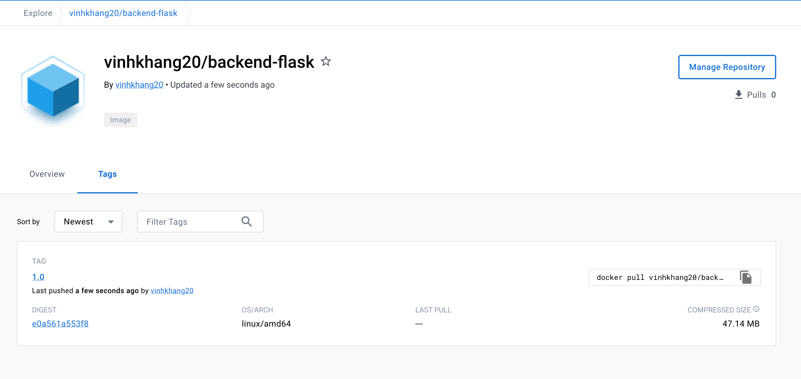
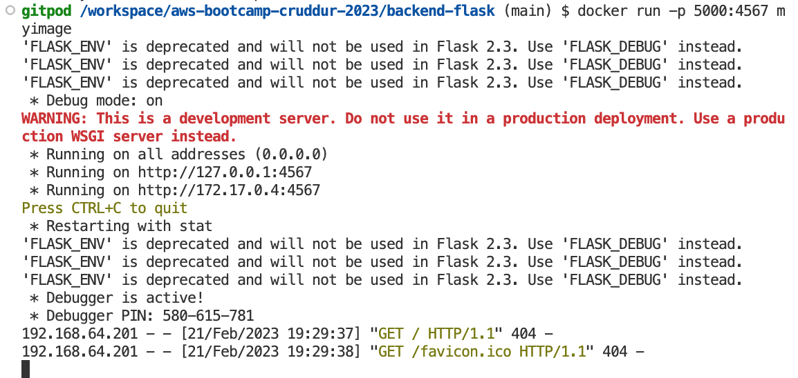

# Week 1 — App Containerization
## Student Discord name : Kang The Conqueror#6060

### **1. Run the dockerfile CMD as an external script**
I put the CMD command from the Dockerfile into a script and then call that script from the CMD instruction in the Dockerfile. 

First, create a script file called `run.sh` that contains the same command :
> #!/bin/bash  
> python3 -m flask run --host=0.0.0.0 --port=4567  

Second, modify the CMD instruction in the Dockerfile to call the script :
> COPY run.sh /usr/local/bin/  
> RUN chmod +x /usr/local/bin/run.sh  
> CMD ["/usr/local/bin/run.sh"]

### **2. Push and tag a image to DockerHub (they have a free tier)**
First, login to Docker using using the `docker login` command
> docker login  

Second, tag the Docker image with a specific version or tag name using the docker tag command:
> docker tag backend-flask vinhkhang20/backend-flask:1.0

Here, I tag the image `backend-flask` with presumed version `1.0`.  
Third, Push the tagged Docker image to Docker Hub using the docker push command:
> docker push vinhkhang20/backend-flask:1.0

This will upload the Docker image to Docker Hub and make it available for others to download and use.

Finally, check out the Docker hub page to confirm there is an image with tag available. 

### **3. Use multi-stage building for a Dockerfile build**

Use multi-stage builds for the given Dockerfile backend-flask : 
> *# Stage 1: Build the application*  
FROM python:3.10-slim-buster AS build  
WORKDIR /backend-flask   
COPY requirements.txt .  
RUN pip3 install -r requirements.txt  
COPY . .  

> *# Stage 2: Build the final image*  
FROM python:3.10-slim-buster  
WORKDIR /backend-flask  
COPY --from=build /root/.local /root/.local  
COPY --from=build /app .  
ENV PATH=/root/.local/bin:$PATH  
ENV FLASK_ENV=development  
EXPOSE ${PORT}  
CMD [ "python3", "-m" , "flask", "run", "--host=0.0.0.0", "--port=4567"]  

Finally, we can build docker image and then run this docker image. 
> docker build -t myiamge .  
> docker run -p 4567:4567 myimage

### **4. Implement a healthcheck in the V3 Docker compose file**

### **5. Research best practices of Dockerfiles and attempt to implement it in your Dockerfile**

### **6. Learn how to install Docker on your localmachine and get the same containers running outside of Gitpod / Codespaces**

### **7. Launch an EC2 instance that has docker installed, and pull a container to demonstrate you can run your own docker processes.**
